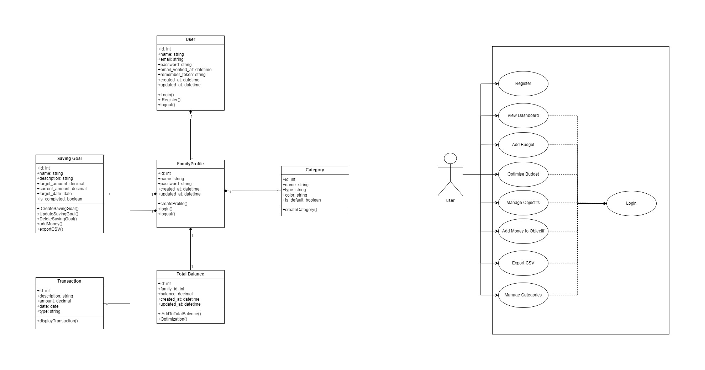

# abdelmouhaimine-eljassimi-SaveSmart

# SaveSmart - Gestion Financière Personnelle

SaveSmart est une application web conçue pour aider les utilisateurs à gérer leurs finances personnelles de manière simple et efficace. Ce projet a été développé dans le cadre d'un cursus intermédiaire, combinant la mise en pratique des compétences Laravel et la gestion de projet en mode agile.

---

## Table des Matières
1. [Contexte du Projet](#contexte-du-projet)
2. [Objectifs du Projet](#objectifs-du-projet)
    - [Fonctionnels](#objectifs-fonctionnels)
    - [Techniques](#objectifs-techniques)
3. [Fonctionnalités](#fonctionnalités)
4. [Technologies Utilisées](#technologies-utilisées)
5. [Installation](#installation)
6. [Diagrammes](#diagrammes)
7. [Tests](#tests)
8. [Contribuer](#contribuer)
9. [Licence](#licence)

---

## Contexte du Projet

Face à l’importance de la gestion financière personnelle, SaveSmart se présente comme un outil simple et efficace pour aider chacun à maîtriser ses finances. Ce projet s’inscrit dans un cursus de niveau intermédiaire, alliant la mise en pratique des compétences Laravel et la gestion de projet en mode agile.

---

## Objectifs du Projet

### Objectifs Fonctionnels
- **S1** : Permettre l’inscription/authentification sécurisée des utilisateurs.
- **S1** : Ajout de plusieurs utilisateurs sous un même compte familial.
- **S1** : Gérer la saisie et le suivi des revenus, dépenses et objectifs financiers via des formulaires CRUD.
- **S1** : Offrir des visualisations graphiques simples (tableaux, diagrammes) pour illustrer la répartition du budget.
- **S1** : Ajout de catégories personnalisables (ex. Alimentation, Logement, Divertissement, Épargne).
- **S2** : Création d’objectifs d’épargne (ex. Acheter un PC, Partir en vacances).
- **S2** : Affichage de la progression par rapport aux montants économisés.
- **S2** : Développer un algorithme d’optimisation budgétaire (basé sur des règles logiques et non sur l’IA) qui propose une répartition du budget en fonction des priorités définies (ex. besoins, envies, épargne).
- **S2** : Ajout méthodes d’optimisation 50/30/20 (Besoins 50% / Envies 30% / Épargne 20%).
- **S2** : Export des données en PDF ou CSV.

### Objectifs Techniques
- Mise en place d’un environnement Laravel complet (installation, configuration, structuration MVC).
- Intégration d’un système de tests unitaires et fonctionnels pour garantir la robustesse du code.

---

## Fonctionnalités
- **Inscription et Authentification** : Sécurisée avec Laravel Breeze.
- **Gestion Familiale** : Plusieurs utilisateurs peuvent rejoindre une famille.
- **Suivi des Finances** : Saisie et suivi des revenus, dépenses et objectifs.
- **Visualisations Graphiques** : Tableaux et diagrammes pour une meilleure compréhension.
- **Catégories Personnalisables** : Ajoutez des catégories pour organiser vos finances.
- **Objectifs d'Épargne** : Définissez et suivez vos objectifs financiers.
- **Optimisation Budgétaire** : Algorithme de répartition 50/30/20.
- **Export des Données** : Exportez vos données en PDF ou CSV.

---

## Technologies Utilisées
- **Backend** : Laravel 11, PHP 8.2
- **Frontend** : Blade, Tailwind CSS, JavaScript
- **Base de Données** : MySQL
- **Outils** : Composer, npm, Git
- **Tests** : PHPUnit

---

## Installation

1. Clonez le dépôt :
   ```bash
   git clone https://github.com/abdelmouhaimine_eljassimi/savesmart.git
   cd savesmart


## Diagrammes

### Diagramme UML
